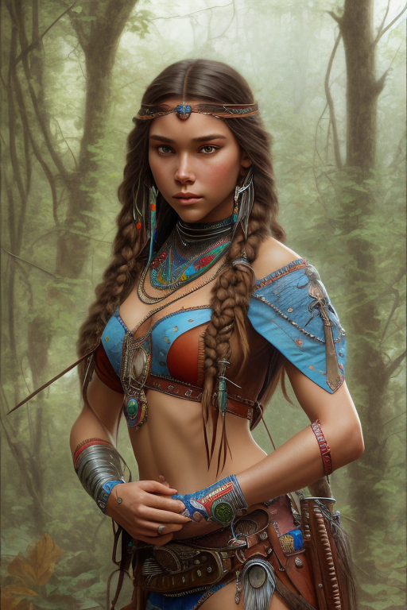

= AI - Images
:hardbreaks:

== Stable Diffusion

.Online
* link:https://www.mage.space/[Mage Space]
* link:https://huggingface.co/spaces/stabilityai/stable-diffusion[Hugging Face - Stable Diffusion]
* link:https://www.patience.ai/[Patience - testing plenty models]
* link:https://dezgo.com/[Dezgo]

.Prompts Examples
* link:https://lexica.art/[Lexica Art]
* link:https://arthub.ai/community[Arthub AI]
* link:https://mpost.io/best-100-stable-diffusion-prompts-the-most-beautiful-ai-text-to-image-prompts/[MPost]
* link:https://decentralizedcreator.com/best-stable-diffusion-anime-prompts/[Decentralized creator]
* link:https://stablediffusion.fr/prompts[Other prompts]
* link:https://prompthero.com/[PromptHero]

.Guide
* link:https://stable-diffusion-art.com/beginners-guide/[Beginner's guide - What is this?]
* link:https://stable-diffusion-art.com/models/[Beginner's guide - Models]
* link:https://stable-diffusion-art.com/fine-tune-your-ai-images-with-these-simple-prompting-techniques[Prompts - Fine tune]

.Books
* link:https://cdn.openart.ai/assets/Stable%20Diffusion%20Prompt%20Book%20From%20OpenArt%2011-13.pdf[Stable Diffusion Prompts]

=== Models

.midjourney-v4-diffusion (mdjrny-v4.safetensors)

* link:https://huggingface.co/prompthero/openjourney[Midjourney v4]
* link:https://huggingface.co/prompthero/openjourney/resolve/main/mdjrny-v4.safetensors[mdjrny-v4.safetensors]

Stable Diffusion fine tuned on Midjourney v4 images.
Use prompt: mdjrny-v4 style

.Anim - Anything-V3.0 (Anything-V3.0-pruned.safetensors)

* link:https://huggingface.co/Linaqruf/anything-v3.0[Anything-V3.0]
* link:https://huggingface.co/Linaqruf/anything-v3.0/resolve/main/Anything-V3.0-pruned.safetensors[Anything-V3.0-pruned.safetensors]

A latent diffusion model for weebs. This model is intended to produce high-quality, highly detailed anime style with just a few prompts. 
Like other anime-style Stable Diffusion models, it also supports danbooru tags to generate images.

=== Installation - Local

AUTOMATIC1111 seems the easiest and flexible way to install.

* link:https://aituts.com/automatic1111s-webgui-apple-silicon/[Installation for Mac M1]
* link:https://github.com/AUTOMATIC1111/stable-diffusion-webui/wiki/Installation-on-Apple-Silicon[repo for AUTOMATIC1111]

.Installation for Mac M1
[source,bash]
----
$ brew -v
Homebrew 3.6.14
Homebrew/homebrew-core (git revision 44342c8b59f; last commit 2022-12-08)
Homebrew/homebrew-cask (git revision d9d556039c; last commit 2022-12-08)

$ brew install cmake protobuf rust python@3.10 git wget

$ git clone https://github.com/AUTOMATIC1111/stable-diffusion-webui
...
$ stable-diffusion-webui

# download models into stable-diffusion-webui/models/Stable-diffusion

$ ./webui.sh 

# wait to see Running on a local URL: https://127.0.0.1:7860
----

== Prompts

.Example of Negative prompts:
    disfigured, kitsch, ugly, oversaturated, greain, low-res, deformed, blurry, noise, deformed, defective, incoherent, twisted, bad anatomy, disfigured, poorly drawn face, mutation, mutated, extra limb, extra finger, ugly, poorly drawn hands, missing limb, floating limbs, disconnected limbs, malformed hands, blur, out of focus, long neck, long body, disgusting, poorly drawn, childish, mutilated, mangled, old, surreal

== Questions / Answers

.What are *fp16* vs *fp32* model differences ?
In short, fp16 reduces memory footprint and CPU consumption while having little downside on quality.
fp16 migh therefore be helpful to train faster, which little chances to overfit

.What is *safetensors* ?
See link:https://github.com/huggingface/safetensors[].
This basically addresses a few limitations and security aspects of *ckpt* (pickle)