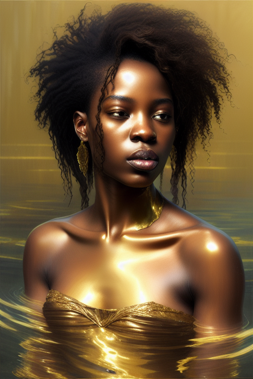

= AI - Images

== Stable Diffusion

.Online
* link:https://www.mage.space/[Mage Space]
* link:https://huggingface.co/spaces/stabilityai/stable-diffusion[Hugging Face - Stable Diffusion]
* link:https://www.patience.ai/[Patience - testing plenty models]
* link:https://dezgo.com/[Dezgo]

.Prompts Examples
* link:https://lexica.art/[Lexica Art]
* link:https://arthub.ai/community[Arthub AI]
* link:https://mpost.io/best-100-stable-diffusion-prompts-the-most-beautiful-ai-text-to-image-prompts/[MPost]
* link:https://decentralizedcreator.com/best-stable-diffusion-anime-prompts/[Decentralized creator]
* link:https://stablediffusion.fr/prompts[Other prompts]
* link:https://prompthero.com/[PromptHero]

.Guide
* link:https://stable-diffusion-art.com/[Stable Diffusion Art - Guides]
* link:https://stable-diffusion-art.com/beginners-guide/[Beginner's guide - What is this?]
* link:https://stable-diffusion-art.com/models/[Beginner's guide - Models]
* link:https://stable-diffusion-art.com/how-to-use-vae/[Beginner's guide - VAE]
* link:https://stable-diffusion-art.com/how-to-use-negative-prompts/[Beginner's guide - Negative Prompts]
* link:https://stable-diffusion-art.com/fine-tune-your-ai-images-with-these-simple-prompting-techniques[Prompts - Fine tune]

.Books
* link:https://cdn.openart.ai/assets/Stable%20Diffusion%20Prompt%20Book%20From%20OpenArt%2011-13.pdf[Stable Diffusion Prompts]

=== Models

.Common - link:https://huggingface.co/runwayml/stable-diffusion-v1-5[Stable Diffusion v1.5] (v1-5-pruned-emaonly.safetensors)

    Base for most models.

.Common - https://huggingface.co/stabilityai/stable-diffusion-2-1[Stable Diffusion v2.1] (v2-1_768-ema-pruned.safetensors)

    Base for most models.

.Other - link:https://huggingface.co/prompthero/openjourney[Midjourney v4] (mdjrny-v4.safetensors)

    Stable Diffusion fine tuned on Midjourney v4 images.
    Use prompt: mdjrny-v4 style

image:images/mdjrny-v4-3929705648.png[200,300,link="images/mdjrny-v4-3929705648.txt"]

.Anim - link:https://huggingface.co/Linaqruf/anything-v3.0[Anything-V3.0] (Anything-V3.0-pruned.safetensors)

A latent diffusion model for weebs. This model is intended to produce high-quality, highly detailed anime style with just a few prompts. 
Like other anime-style Stable Diffusion models, it also supports danbooru tags to generate images.

.Other - link:https://huggingface.co/dallinmackay/JWST-Deep-Space-diffusion[JWST Deep Space Diffusion] (JWST-Deep-Space.ckpt)

This is a fine-tuned Stable Diffusion model (based on v1.5) trained on images taken by the James Webb Space Telescope, as well as Judy Schmidt. 
Use the token JWST in your prompts to use the style (e.g., jwst, green spiral galaxy).

.Comic - link:https://huggingface.co/ogkalu/Comic-Diffusion[Comic Diffusion] (comic-diffusion-V2.ckpt)

    Includes 6 comic styles.
        The tokens for V2 are:
        charliebo artstyle
        holliemengert artstyle
        marioalberti artstyle
        pepelarraz artstyle
        andreasrocha artstyle
        jamesdaly artstyle

.Photo - link:https://huggingface.co/darkstorm2150/Protogen_x5.8_Official_Release[ProtoGen_X5.8] (ProtoGen_X5.8-pruned-fp16.safetensors)

.Photo - link:https://huggingface.co/dreamlike-art/dreamlike-photoreal-2.0[DreamLike Photoreal] (dreamlike-photoreal-2.0.safetensors)

    Dreamlike Photoreal 2.0 is a photorealistic model based on Stable Diffusion 1.5, made by dreamlike.art.v

.Crafting - link:https://huggingface.co/Fictiverse/Stable_Diffusion_PaperCut_Model[Paper Cut model] (PaperCut_v1.ckpt)

    PaperCut in your prompts.
    

=== Installation - Local

AUTOMATIC1111 seems the easiest and flexible way to install.

* link:https://aituts.com/automatic1111s-webgui-apple-silicon/[Installation for Mac M1]
* link:https://github.com/AUTOMATIC1111/stable-diffusion-webui/wiki/Installation-on-Apple-Silicon[repo for AUTOMATIC1111]

.Installation for Mac M1
[source,bash]
----
$ brew -v
Homebrew 3.6.14
Homebrew/homebrew-core (git revision 44342c8b59f; last commit 2022-12-08)
Homebrew/homebrew-cask (git revision d9d556039c; last commit 2022-12-08)

$ brew install cmake protobuf rust python@3.10 git wget

$ git clone https://github.com/AUTOMATIC1111/stable-diffusion-webui
...
$ stable-diffusion-webui

# download models into stable-diffusion-webui/models/Stable-diffusion

$ ./webui.sh 

# wait to see Running on a local URL: https://127.0.0.1:7860
----

== Prompts

=== Negative

Negative prompts is mandatory for good results.

Here are sets of examples helping:

.Example of General:
    disfigured, kitsch, ugly, oversaturated, greain, low-res, deformed, blurry, noise, defective, incoherent, blur, out of focus, old, surreal, tiling, out of frame, body out of frame, cut off, (watermark:1.5), signature, (words), letters, (logo:1.5), sign, writing, poorly drawn, text,

.Example Anatomy:
    twisted, (bad anatomy:1.5), disfigured, poorly drawn face, mutation, mutated, extra limb, extra limbs, extra legs, extra arms, extra finger, too many fingers, fused fingers,
    poorly drawn hands, poorly drawn feet, extra feet, missing limb, floating limbs, disconnected limbs, limbs fused with body, 
    malformed hands, long neck, long body, floating arms, (too many arms:1.5),
    disgusting, poorly drawn, mutilated, mangled, floating head, doubled head, unattached head, doubled head, head in body, (misshapen body:1.1),
    (bad hands:1.3), (mangled hands:1.2), (missing hands), (missing arms), backward hands,
    
.Example Face:
    untracked eyes, imperfect eyes, cross-eye, crossed eyes, asymmetric eyes, (facial blemish:1.5), partial faces, hair not attached to head
== Questions / Answers

.What are *fp16* vs *fp32* model differences ?
In short, fp16 reduces memory footprint and CPU consumption while having little downside on quality.
fp16 migh therefore be helpful to train faster, which little chances to overfit

.What is *safetensors* ?
See link:https://github.com/huggingface/safetensors[].
This basically addresses a few limitations and security aspects of *ckpt* (pickle)
Note: To enable SafeTensors for GPU, the SAFETENSORS_FAST_GPU environment variable needs to be set to 1

== Security

* link:https://github.com/mmaitre314/picklescan[Pickle Scanner]

== Lab

* link:https://lablab.ai/t/stable-diffusion-lexica[LabLab]

[source,bash]
----
$ wget https://lexica.art/api/v1/search?q=apples
----

