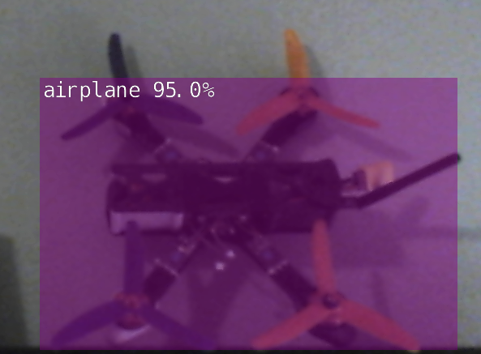

:toc:

= Jetson Nano

image:jetson-nano-dev-kit.png[]

== Setup

=== Install OS

* Download link:https://developer.nvidia.com/jetson-nano-sd-card-image-r322[Jetson Nano Developer Kit SD Card Image]
* Use link:https://www.balena.io/etcher[Etcher] to format SD card of 16+ GB
* Wire up screen HDML + keyboard + mouse + network
* Boot up and respond questions

=== Power options

See link:https://desertbot.io/blog/jetson-nano-power-supply-barrel-vs-micro-usb[Power supply solutions]

Setup Barrel Jack (5V 4A) Power Supply: Add jumper on J48
  
Install/Run Jetson Stats

  $ sudo apt-get install python3-pip
  $ sudo pip3 install -U pip
  $ sudo -H pip install -U jetson-stats
  $ sudo jtop

=== Docker (nvidia)

* Upgrade Docker (to benefit from > 19.03 gpu capabilities):

  $ sudo apt update
  $ sudo apt install curl
  $ curl -sSL https://get.docker.com/ | sh
  $ sudo usermod -aG docker clement
  ... logout / login here !
  $ docker version
  
//* Install Docker Compose
//  $ sudo apt update
//  $ sudo apt install -y python3-pip libffi-dev python3-openssl
//  $ sudo pip3 install docker-compose
//  $ docker-compose version

* Check install

  $ sudo docker info | grep nvidia
  Runtimes: nvidia runc
  $ sudo dpkg --get-selections | grep nvidia

.*sudo dpkg --get-selections | grep nvidia* output
[%collapsible]
====
[source,sh]
----
$ sudo dpkg --get-selections | grep nvidia
libnvidia-container-tools			install
libnvidia-container0:arm64			install
nvidia-container-csv-cuda			install
nvidia-container-csv-cudnn			install
nvidia-container-csv-tensorrt			install
nvidia-container-csv-visionworks		install
nvidia-container-runtime			install
nvidia-container-toolkit			install
nvidia-docker2					install
nvidia-jetpack					install
nvidia-l4t-3d-core				install
nvidia-l4t-apt-source				install
nvidia-l4t-bootloader				install
nvidia-l4t-camera				install
nvidia-l4t-ccp-t210ref				install
nvidia-l4t-configs				install
nvidia-l4t-core					install
nvidia-l4t-cuda					install
nvidia-l4t-firmware				install
nvidia-l4t-graphics-demos			install
nvidia-l4t-gstreamer				install
nvidia-l4t-init					install
nvidia-l4t-initrd				install
nvidia-l4t-jetson-io				install
nvidia-l4t-jetson-multimedia-api		install
nvidia-l4t-kernel				install
nvidia-l4t-kernel-dtbs				install
nvidia-l4t-kernel-headers			install
nvidia-l4t-multimedia				install
nvidia-l4t-multimedia-utils			install
nvidia-l4t-oem-config				install
nvidia-l4t-tools				install
nvidia-l4t-wayland				install
nvidia-l4t-weston				install
nvidia-l4t-x11					install
nvidia-l4t-xusb-firmware			install
----
====

* Verify the Linux Kernel directly

  $ wget https://github.com/moby/moby/raw/master/contrib/check-config.sh
  $ chmod +x check-config.sh
  $ ./check-config.sh
  ...

.*Output of ./check-config.sh*
[%collapsible]
====
[source,sh]
----
$ ./check-config.sh
info: reading kernel config from /proc/config.gz ...

Generally Necessary:
- cgroup hierarchy: properly mounted [/sys/fs/cgroup]
- CONFIG_NAMESPACES: enabled
- CONFIG_NET_NS: enabled
- CONFIG_PID_NS: enabled
- CONFIG_IPC_NS: enabled
- CONFIG_UTS_NS: enabled
- CONFIG_CGROUPS: enabled
- CONFIG_CGROUP_CPUACCT: enabled
- CONFIG_CGROUP_DEVICE: enabled
- CONFIG_CGROUP_FREEZER: enabled
- CONFIG_CGROUP_SCHED: enabled
- CONFIG_CPUSETS: enabled
- CONFIG_MEMCG: enabled
- CONFIG_KEYS: enabled
- CONFIG_VETH: enabled (as module)
- CONFIG_BRIDGE: enabled
- CONFIG_BRIDGE_NETFILTER: enabled (as module)
- CONFIG_NF_NAT_IPV4: enabled (as module)
- CONFIG_IP_NF_FILTER: enabled (as module)
- CONFIG_IP_NF_TARGET_MASQUERADE: enabled (as module)
- CONFIG_NETFILTER_XT_MATCH_ADDRTYPE: enabled (as module)
- CONFIG_NETFILTER_XT_MATCH_CONNTRACK: enabled (as module)
- CONFIG_NETFILTER_XT_MATCH_IPVS: enabled (as module)
- CONFIG_IP_NF_NAT: enabled (as module)
- CONFIG_NF_NAT: enabled (as module)
- CONFIG_NF_NAT_NEEDED: enabled
- CONFIG_POSIX_MQUEUE: enabled

Optional Features:
- CONFIG_USER_NS: enabled
- CONFIG_SECCOMP: enabled
- CONFIG_CGROUP_PIDS: enabled
- CONFIG_MEMCG_SWAP: enabled
- CONFIG_MEMCG_SWAP_ENABLED: enabled
    (cgroup swap accounting is currently enabled)
- CONFIG_BLK_CGROUP: enabled
- CONFIG_BLK_DEV_THROTTLING: enabled
- CONFIG_IOSCHED_CFQ: enabled
- CONFIG_CFQ_GROUP_IOSCHED: missing
- CONFIG_CGROUP_PERF: enabled
- CONFIG_CGROUP_HUGETLB: enabled
- CONFIG_NET_CLS_CGROUP: enabled
- CONFIG_CGROUP_NET_PRIO: enabled
- CONFIG_CFS_BANDWIDTH: enabled
- CONFIG_FAIR_GROUP_SCHED: enabled
- CONFIG_RT_GROUP_SCHED: enabled
- CONFIG_IP_NF_TARGET_REDIRECT: enabled (as module)
- CONFIG_IP_VS: enabled (as module)
- CONFIG_IP_VS_NFCT: enabled
- CONFIG_IP_VS_PROTO_TCP: enabled
- CONFIG_IP_VS_PROTO_UDP: enabled
- CONFIG_IP_VS_RR: enabled (as module)
- CONFIG_EXT4_FS: enabled
- CONFIG_EXT4_FS_POSIX_ACL: enabled
- CONFIG_EXT4_FS_SECURITY: enabled
- Network Drivers:
  - "overlay":
    - CONFIG_VXLAN: enabled
    - CONFIG_BRIDGE_VLAN_FILTERING: enabled
      Optional (for encrypted networks):
      - CONFIG_CRYPTO: enabled
      - CONFIG_CRYPTO_AEAD: enabled
      - CONFIG_CRYPTO_GCM: enabled
      - CONFIG_CRYPTO_SEQIV: enabled
      - CONFIG_CRYPTO_GHASH: enabled
      - CONFIG_XFRM: enabled
      - CONFIG_XFRM_USER: enabled
      - CONFIG_XFRM_ALGO: enabled
      - CONFIG_INET_ESP: enabled (as module)
      - CONFIG_INET_XFRM_MODE_TRANSPORT: enabled
  - "ipvlan":
    - CONFIG_IPVLAN: enabled
  - "macvlan":
    - CONFIG_MACVLAN: enabled (as module)
    - CONFIG_DUMMY: enabled
  - "ftp,tftp client in container":
    - CONFIG_NF_NAT_FTP: enabled (as module)
    - CONFIG_NF_CONNTRACK_FTP: enabled (as module)
    - CONFIG_NF_NAT_TFTP: enabled (as module)
    - CONFIG_NF_CONNTRACK_TFTP: enabled (as module)
- Storage Drivers:
  - "aufs":
    - CONFIG_AUFS_FS: missing
  - "btrfs":
    - CONFIG_BTRFS_FS: enabled (as module)
    - CONFIG_BTRFS_FS_POSIX_ACL: enabled
  - "devicemapper":
    - CONFIG_BLK_DEV_DM: enabled
    - CONFIG_DM_THIN_PROVISIONING: missing
  - "overlay":
    - CONFIG_OVERLAY_FS: enabled (as module)
  - "zfs":
    - /dev/zfs: missing
    - zfs command: missing
    - zpool command: missing

Limits:
- /proc/sys/kernel/keys/root_maxkeys: 1000000
----
====

== Tips

* GUI Enable/Disable

Source link:https://imadelhanafi.com/posts/jetson_nano_setup/[]

.*GUI enable/disable tips*
[%collapsible]
====
[source,sh]
----
# disable GUI on boot
# After applying this command, the next time you reboot it will be on terminal mode
sudo systemctl set-default multi-user.target

# To enable GUI again
sudo systemctl set-default graphical.target

# To start GUI session on a system in terminal mode
sudo systemctl start gdm3.service
----
====

* Checking current power mode:

.*Power tips*
[%collapsible]
====
[source,sh]
----
  $ sudo nvpmodel -q
  NVPM WARN: fan mode is not set!
  NV Power Mode: 5W
  1

Set 5W / 10W mode (respectively):

  $ sudo nvpmodel -m 1 
  or
  $ sudo nvpmodel -m 0
----
====

== Tests

=== Camera

Source link:https://collabnix.com/why-docker-19-03-on-nvidia-jetson-nano/[]

.*Camera test*
[%collapsible]
====
[source,sh]
----
  $ git clone https://github.com/ajeetraina/docker-cctv-raspbian
  $ cd docker-cctv-raspbian/
  ... plug USB cam
  $ docker build -t collabnix/docker-cctv-raspbi .
  $ sh run.sh 
  $ docker ps -a
  ... move the cam => some files should be created under videos folder
----
====

.*Camera Utils*
[%collapsible]
====
[source,sh]
----
$ sudo apt-get install v4l-utils
$ v4l2-ctl -d /dev/video0 --list-formats-ext
$ gst-launch-1.0 v4l2src device="/dev/video0" ! xvimagesink -e
----
====

=== GPU / CUDA

Source link:https://github.com/NVIDIA/nvidia-docker/wiki/NVIDIA-Container-Runtime-on-Jetson[]

.*GPU/CUDA run from Docker*
[%collapsible]
====
[source,sh]
----
# Allow containers to communicate with Xorg
$ sudo xhost +si:localuser:root
$ sudo docker run --runtime nvidia --network host -it -e DISPLAY=$DISPLAY -v /tmp/.X11-unix/:/tmp/.X11-unix nvcr.io/nvidia/l4t-base:r32.3.1

root@nano:/# apt-get update && apt-get install -y --no-install-recommends make g++
root@nano:/# cp -r /usr/local/cuda/samples /tmp
root@nano:/# cd /tmp/samples/5_Simulations/nbody
root@nano:/# make
root@nano:/# ./nbody
----
====

.*Building Docker image for CUDA samples*
[%collapsible]
====
[source,sh]
----
$ mkdir /tmp/docker-build && cd /tmp/docker-build
$ cp -r /usr/local/cuda/samples/ ./
$ tee ./Dockerfile <<EOF
FROM nvcr.io/nvidia/l4t-base:r32.3.1

RUN apt-get update && apt-get install -y --no-install-recommends make g++
COPY ./samples /tmp/samples

WORKDIR /tmp/samples/1_Utilities/deviceQuery
RUN make clean && make

CMD ["./deviceQuery"]
EOF

$ sudo docker build -t devicequery .
----
====

.*CUDA devicequery on Jetson Nano (docker)* output
[%collapsible]
====
[source,sh]
----
$ sudo docker run -it --runtime nvidia devicequery
./deviceQuery Starting...

 CUDA Device Query (Runtime API) version (CUDART static linking)

Detected 1 CUDA Capable device(s)

Device 0: "NVIDIA Tegra X1"
  CUDA Driver Version / Runtime Version          10.0 / 10.0
  CUDA Capability Major/Minor version number:    5.3
  Total amount of global memory:                 3956 MBytes (4148523008 bytes)
  ( 1) Multiprocessors, (128) CUDA Cores/MP:     128 CUDA Cores
  GPU Max Clock rate:                            922 MHz (0.92 GHz)
  Memory Clock rate:                             1600 Mhz
  Memory Bus Width:                              64-bit
  L2 Cache Size:                                 262144 bytes
  Maximum Texture Dimension Size (x,y,z)         1D=(65536), 2D=(65536, 65536), 3D=(4096, 4096, 4096)
  Maximum Layered 1D Texture Size, (num) layers  1D=(16384), 2048 layers
  Maximum Layered 2D Texture Size, (num) layers  2D=(16384, 16384), 2048 layers
  Total amount of constant memory:               65536 bytes
  Total amount of shared memory per block:       49152 bytes
  Total number of registers available per block: 32768
  Warp size:                                     32
  Maximum number of threads per multiprocessor:  2048
  Maximum number of threads per block:           1024
  Max dimension size of a thread block (x,y,z): (1024, 1024, 64)
  Max dimension size of a grid size    (x,y,z): (2147483647, 65535, 65535)
  Maximum memory pitch:                          2147483647 bytes
  Texture alignment:                             512 bytes
  Concurrent copy and kernel execution:          Yes with 1 copy engine(s)
  Run time limit on kernels:                     Yes
  Integrated GPU sharing Host Memory:            Yes
  Support host page-locked memory mapping:       Yes
  Alignment requirement for Surfaces:            Yes
  Device has ECC support:                        Disabled
  Device supports Unified Addressing (UVA):      Yes
  Device supports Compute Preemption:            No
  Supports Cooperative Kernel Launch:            No
  Supports MultiDevice Co-op Kernel Launch:      No
  Device PCI Domain ID / Bus ID / location ID:   0 / 0 / 0
  Compute Mode:
     < Default (multiple host threads can use ::cudaSetDevice() with device simultaneously) >

deviceQuery, CUDA Driver = CUDART, CUDA Driver Version = 10.0, CUDA Runtime Version = 10.0, NumDevs = 1
Result = PASS
----
====

.*Testing Ocean rendering (docker)* output
[%collapsible]
====
[source,sh]
----
$ sudo docker run --runtime nvidia --network host -it -e DISPLAY=$DISPLAY -v /tmp/.X11-unix/:/tmp/.X11-unix nvcr.io/nvidia/l4t-base:r32.3.1
$ cd /tmp/samples/5_Simulations/oceanFFT
$ make
$ ./oceanFFT
----
====

.*Building all CUDA examples (non-docker)*
[%collapsible]
====
[source,sh]
----
$ /usr/local/cuda/bin/cuda-install-samples-10.0.sh ~
$ cd ~/NVIDIA_CUDA-10.0_Samples/
$ make
$ cd bin/aarch64/linux/release
$ ./matrixMul
----
====

.*Building VisionWorks examples (non-docker)*
[%collapsible]
====
[source,sh]
----
$ /usr/share/visionworks/sources/install-samples.sh
$ cd ~/VisionWorks-1.6-Samples
$ make
$ cd bin/aarch64/linux/release
$ ./nvx_demo_feature_tracker
----
====

=== Live streaming detection

.Testing ImageNet & DetectNet
[%collapsible]
====
[source,sh]
----
$ sudo apt-get install git cmake
$ git clone https://github.com/dusty-nv/jetson-inference
$ cd jetson-inference
$ git submodule update --init
$ mkdir build
$ cd build
$ cmake ../
$ sudo make install
$ cd aarch64/bin
$ ./imagenet-camera googlenet --camera=/dev/video0
or
$ ./detectnet-camera googlenet --camera=/dev/video0
----
====

=== Live streaming FaceNet

Source link:https://github.com/nwesem/mtcnn_facenet_cpp_tensorRT[]

[%collapsible]
====
[source,bash]
----
### Clone repo
$ cd ~/workspace/tests/
$ git clone https://github.com/nwesem/mtcnn_facenet_cpp_tensorRT.git
$ cd mtcnn_facenet_cpp_tensorRT/

### Install pre-requisits
$ sudo apt-get install cmake libopenblas-dev
# OpenCV (https://elinux.org/Jetson_Zoo#OpenCV)
$ sudo apt-get install libhdf5-serial-dev hdf5-tools libhdf5-dev zlib1g-dev zip libjpeg8-dev
$ sudo apt-get install python3-pip
$ sudo pip3 install -U pip testresources setuptools
$ sudo pip3 install -U numpy==1.16.1 future==0.17.1 mock==3.0.5 h5py==2.9.0 keras_preprocessing==1.0.5 keras_applications==1.0.8 gast==0.2.2 enum34 futures protobuf
$ sudo pip3 install --pre --extra-index-url https://developer.download.nvidia.com/compute/redist/jp/v43 'tensorflow-gpu<2'

### Download model
$ wget https://github.com/apollo-time/facenet/raw/master/model/resnet/facenet.pb

### Convert frozen protobuf (.pb) model to UFF
$ python3 ./step01_pb_to_uff.py

### Copy models
$ cd ..
$ git clone https://github.com/PKUZHOU/MTCNN_FaceDetection_TensorRT
$ mv MTCNN_FaceDetection_TensorRT/det* mtcnn_facenet_cpp_tensorRT/mtCNNModels

### Build
## FIXME: replace CV_RGB2BGR by cv::COLOR_RGB2BGR in src/*.cpp
$ mkdir build && cd build
$ cmake -DCMAKE_BUILD_TYPE=Release ..
$ make -j${nproc}

### Execute
$ ./mtcnn_facenet_cpp_tensorRT

KO !!!
----
====

Source link:https://medium.com/@ageitgey/build-a-hardware-based-face-recognition-system-for-150-with-the-nvidia-jetson-nano-and-python-a25cb8c891fd[face-recognition-system-for-150-with-the-nvidia-jetson-nano-and-python]

[%collapsible]
====
This sample works!
Faces in front of webcam are detected and flagged as Users.
Same face comming back later will be recognized.

[source,bash]
----
### Pre-requisits
$ sudo apt-get install python3-pip cmake libopenblas-dev liblapack-dev libjpeg-dev

### Install SWAP to enable build-ability
$ git clone https://github.com/JetsonHacksNano/installSwapfile
$ ./installSwapfile/installSwapfile.sh

### Build numpy
# SKIP $ pip3 install numpy

### Install Face reco app (expect very long time > 30min)
$ sudo pip3 install face_recognition

### Run the cam tool (If need, change the code to use USB cam instead of PiCam)
$ wget -O doorcam.py tiny.cc/doorcam
$ python3 doorcam.py

# ALT: more examples at https://github.com/ageitgey/face_recognition#python-code-examples
----
====

== Examples

* link:https://github.com/dusty-nv/jetson-inference/blob/master/docs/building-repo-2.md[]
* link:https://github.com/dusty-nv/jetson-inference/blob/master/docs/imagenet-console-2.md[]
* link:https://github.com/dusty-nv/jetson-inference/blob/master/docs/imagenet-example-python-2.md[]

== Links

* link:https://developer.nvidia.com/embedded/learn/get-started-jetson-nano-devkit[Get Started]
* link:https://developer.nvidia.com/embedded/dlc/jetson-nano-dev-kit-user-guide[User Guide]
* link:https://docs.nvidia.com/jetson/l4t/[Jetson Docs]
* link:https://developer.nvidia.com/embedded/downloads#?tx=$product,jetson_nano[Download]
* link:https://developer.nvidia.com/embedded/faq[FAQ]

* link:https://devblogs.nvidia.com/jetson-nano-ai-computing/[Jetson Nano AI computing]
* link:https://www.dlology.com/blog/how-to-run-keras-model-on-jetson-nano-in-nvidia-docker-container/[Blog jetson keras docker]
* link:https://elinux.org/Jetson_Zoo[Jetson Zoo]
* link:https://elinux.org/Jetson_Nano[]

* link:https://courses.nvidia.com/courses/course-v1:DLI+C-RX-02+V1/about[Training Courses]
* link:https://developer.nvidia.com/embedded/twodaystoademo[Two Days Training]
