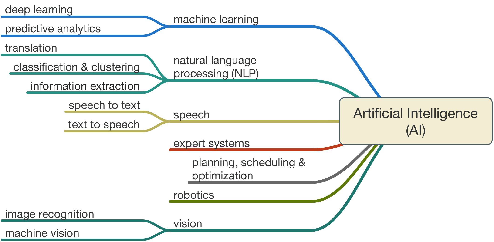

= Machine Learning & Deep Learning

Here are few resources gathered and/or created in course of studying Machine Learning.

== Overview

.Best Languages
* Python
* Julia

.Best module python
[%collapsible]
====
    $ pip install numpy
    $ pip install scipy
    $ pip install pandas
    $ pip install matplotlib
    $ pip install scikit-learn
    $ pip install nltk
    $ pip install opencv-python
====

.Best utilities python
[%collapsible]
====
    $ pip install requests
    $ pip install bs4
    $ pip install pillow
    $ pip install redis
    $ pip install virtualenv
    $ pip install pickle
====

.Best Frameworks
* Tensorflow
* Keras
* PyTorch

.Best IDE
[%collapsible]
====
    $ pip install spyder3
    $ pip install jupyter-notebook
====

== Courses & Resources

.Courses
* link:https://www.coursera.org/specializations/deep-learning[]
* link:https://www.udemy.com/course/machinelearning/[]
* link:https://www.udemy.com/course/deeplearning/[]
* link:https://www.udemy.com/course/artificial-intelligence-az/[]

.Books
* Packt Machine Learning Algorithm with link:https://github.com/PacktPublishing/Machine-Learning-Algorithms.git[GIT ML Algorithms]
* Packt Machine Learning for OpenCV with link:https://github.com/mbeyeler/opencv-machine-learning.git[GIT ML OpenCV]
* Packt Mahcine Learning Systems with python with link:https://github.com/luispedro/BuildingMachineLearningSystemsWithPython/tree/third_edition[GIT ML Systems with Python]

.Slides
* link:https://www.slideshare.net/awahid/big-data-and-machine-learning-for-businesses[]

.Info
* link:http://penseeartificielle.fr/tout-pour-bien-debuter-en-machine-learning-4/[]
* link:https://distill.pub/2017/momentum/[]

.News
* link:https://vas3k.com/blog/machine_learning/[Machine Learning - the summary]

.Videos
* link:https://media.ccc.de/v/35c3-9386-introduction_to_deep_learning[Introduction to Deep Learning]

.Gits
* link:https://github.com/spmallick?tab=repositories[]

.Docker Recipes
* link:https://towardsdatascience.com/tensorflow-object-detection-with-docker-from-scratch-5e015b639b0b[Tensorflow ubuntu]

== Recipes

Anaconda image can be found under link:recipes/anaconda[]

Building image:

[source,bash]
----
$ docker build -t kalemena/anaconda:3-2018.12 .
----

Running image, then open http://localhost:8888/ (password is 'root')

[source,bash]
----
$ docker run -p 8888:8888 -v "$PWD/notebooks:/opt/notebooks" -d kalemena/anaconda:3-2018.12
----
